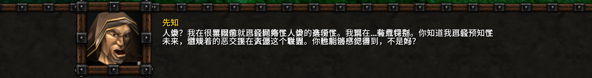

# Nowar Sans for _Warcraft III_

This is Nowar Sans, font packs for _Warcraft III_ (both _Reforged_ and _Classic_) that support all game languages. Nowar Sans is based on [Noto Sans](https://github.com/googlefonts/noto-fonts) and [Source Han Sans](https://github.com/adobe-fonts/source-han-sans).

Looking for font pack for _World of Warcraft_ or _WoW Classic_? Try [Nowar Sans for _World of Warcraft_](https://github.com/nowar-fonts/Nowar-Sans).

> Make Love, Not Warcraft.
>
> 要有爱，不要魔兽争霸。
>
> 要愛，不要魔獸。

## Installation Guide

1. Choose a flavor (see below) and download it at [the download page](https://github.com/nowar-fonts/Nowar-Sans-War3/releases).
2. Unpack `NowarSansWar3-<region>-<weight>-<version>.7z` to
   - `Warcraft III/` (Reforged Retail, Classic Retail) or,
   - `Warcraft III/_ptr_/` (Reforged PTR) or,
   - `Warcraft III Public Test/` (Classic PTR).

### Extra Steps for _Warcraft III Classic_ (1.31 or earlier)

3. Search and launch Registry Editor and navigate to `HKCU\Software\Blizzard Entertainment\Warcraft III` (or `...\Warcraft III Public Test`).
4. Create a DWORD entry of name `Allow Local Files` and value `1`.

Alternatively, you can download `enable-fonts.reg` from [regs/](regs/) and import it to the registry.

## Choose Your Flavor

[Latest release at GitHub](https://github.com/nowar-fonts/Nowar-Sans-War3/releases)

Mirrors: [Gitee (release repo)](https://gitee.com/nowar-fonts/Nowar-Sans-War3)

Nowar Sans is shipped in 5 weights and 4 regional variants, with several features.

### Weights

* 300: Light
* 372: Normal
* 400: Regular
* 500: Medium
* 700: Bold

### Regional Variants

Bliz and Neut are “standard variants” with regional Chinese character orthographies.

|      | European            | 简体中文       | 繁體中文  | 한국어              |
| ---- | ------------------- | -------------- | --------- | ------------------- |
| Bliz | Mainland China (UI) | Mainland China | Classical | Mainland China (UI) |
| Neut | Classical (UI)      | Mainland China | Taiwan    | Classical (UI)      |

CL is the “classical variant” with classical Chinese character orthography (aka Kāngxī Dictionary forms).

|    | European and 한국어 | 中文      |
| -- | ------------------- | --------- |
| CL | Classical (UI)      | Classical |

PSimp and PSimpChat are special variants for 繁體中文 that remap traditional Chinese character to simplified ones.

|       | 繁體中文                  | European, 简体中文 and 한국어 |
| ----- | ------------------------- | ----------------------------- |
| PSimp | Mainland China (Remapped) | N/A                           |

* European: English, Español (AL), Português, Deutsch, Español (EU), Français, Italiano, and Русский.
* UI: Ambiguous punctations are treated as Western; CJK puctations are half-width.

### Features

| Tag | Name        | Description                                |
| --- | ----------- | ------------------------------------------ |
| OSF | Oldstyle    | Oldstyle (non-lining), propotional figure. |
| SC  | Smallcaps   | Small capitals for Latin.                  |

Pre-built feature variants: `Bliz,OSF`, `Bliz,SC`.

## Known Issue

### Overlapping (or Even Wrong) CJK Texts at High Resolution (1.32.0 or earlier)

After playing for 1 minite or 2 (4k) to serveral minites (2k), or about half an hour (1080p), CJK texts does not display properly. As time goes by, it turns worse.



**Solution**: Run [Battle.net desktop app](https://www.blizzard.com/apps/battle.net/desktop) and upgrade _Warcraft III_ to the latest version.

## How to Build

### Dependencies

+ basic Unix utils,
+ [Python](https://www.python.org/),
+ [otfcc](https://github.com/caryll/otfcc) and
+ [7-Zip](https://www.7-zip.org/) (add to `PATH`).

Note:
+ Choose 64-bit version if possible. 32-bit version may lead to out-of-memory issue.

### Build Feature Variant

Prepare submodules:
```bash
git submodule update --init --recursive
```

Run `configure.py` to generate Makefile:
```bash
python configure.py
```

Put Source Han Sans OTF files (all families but HW) and Subset OTF files (if you need GB variant) to `source/shs/`.

Then make a specific variant:
```bash
make <region>,<features>-<weight> -j<threads>
```
Note: Features must be sorted alphabetically. (`OSF`, `SC`).

e.g.
```bash
make CN,OSF,SC-400 -j4
```

The output is `out/NowarSans-<region>,<features>-<weight>-<version>.7z`.

### Create Regional Variant

To build exactly what you need, modify `configure.py`:
```python
class Config:
    # put your variant here
    fontPackRegion = [ <your_region> ]

# define the variant here.
regionalVariant = { ... }
```

For example, the “CNmulti” multi-orthography variant,

|         | European            | 简体中文       | 繁體中文 | 日本語 (classic chat) | 한국어        |
| ------- | ------------------- | -------------- | -------- | --------------------- | ------------- |
| CNmulti | Mainland China (UI) | Mainland China | Taiwan   | Japan (UI)            | S. Korea (UI) |

```python
class Config:
    fontPackRegion = [ "CNmulti" ]

regionalVariant = {
    "CNmulti": {
        "enUS": "CN",
        "zhCN": "CN",
        "zhTW": "TW",
        "jaJP": "JP",
        "koKR": "KR",
    }
}
```

Then, run `python configure.py` to generate `Makefile`. The new regional variant (with optional feature) can be built by:
```bash
make <region>,<features>-<weight> -j<threads>
```
e.g.
```bash
make CNmulti-400 -j4
make CNmulti,OSF-400 -j4
```

## Credit

Latin, Greek and Cyrillic characters are from [Noto Sans](https://github.com/googlei18n/noto-fonts) by Google.

CJK Ideographs, Kana and Hangul are from [Source Han Sans](https://github.com/adobe-fonts/source-han-sans) by Adobe.

The traditional Chinese to simplified Chinese conversion table is from [Open Chinese Convert project](https://github.com/BYVoid/OpenCC).
