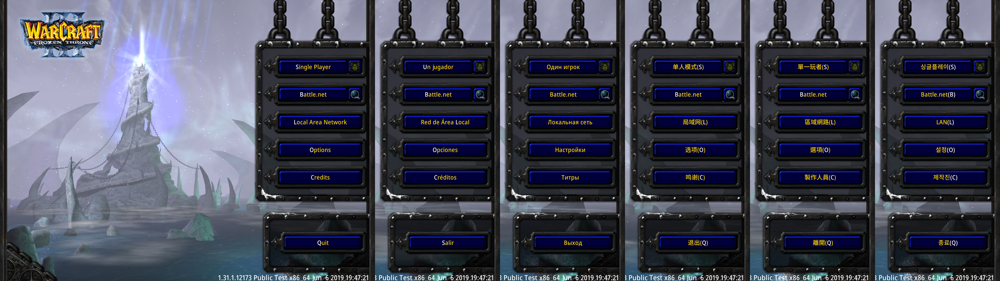
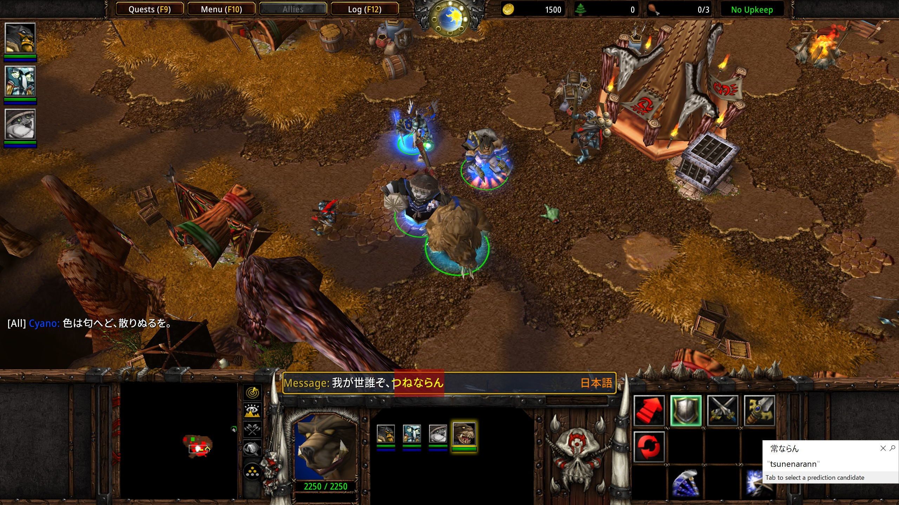

# Nowar Sans for _Warcraft III_

This is Nowar Sans, font packs for _Warcraft III_ that support all game languages. Nowar Sans is based on [Noto Sans](https://github.com/googlei18n/noto-fonts) and [Source Han Sans](https://github.com/adobe-fonts/source-han-sans).

Looking for font pack for _World of Warcraft_ or _WoW Classic_? Try [Nowar Sans for _World of Warcraft_](https://github.com/nowar-fonts/Nowar-Sans).

> Make Love, Not Warcraft.
>
> <ruby>要<rt>Yào</rt><ruby><ruby>有爱<rt>you’ài</rt><ruby>，<ruby>不要<rt>bùyào</rt><ruby><ruby>魔兽争霸<rt>móshòu-zhēngbà</rt><ruby>。
>
> <ruby>要<rt>Yào</rt><ruby><ruby>愛<rt>ài</rt><ruby>，<ruby>不要<rt>bùyào</rt><ruby><ruby>魔獸<rt>móshòu</rt><ruby>。

## Features

### Multilingual Support



### Chat in <ruby>日本語<rt>Nihongo</rt></ruby>



## Installation Guide

1. Choose a flavor (see below) and download it at [the download page](https://github.com/nowar-fonts/Nowar-Sans-War3/releases).
2. Unpack `NowarSansWar3-<region>-<weight>-<version>.7z` to `Warcraft III/` (or `Warcraft III Public Test/`).
3. Search and launch Registry Editor and navigate to `HKCU\Software\Blizzard Entertainment\Warcraft III` (or `...\Warcraft III Public Test`).
4. Create a DWORD entry of name `Allow Local Files` and value `1`.

Alternatively, you can download `enable-fonts.reg` from [regs/](regs/) and import it to the registry.

## Choose Your Flavor

[Latest release](https://github.com/nowar-fonts/Nowar-Sans-War3/releases)

Nowar Sans is shipped in 4 weights and 8 regional variants.

### Weights

* 300: Light
* 400: Regular
* 500: Medium
* 700: Bold

### Regional Variants

CN, TW, HK, JP and KR are “standard variants”, which have full character set support with regional Chinese character orthographies.

| | European | <ruby>简体中文<rt>Jiǎntǐ-zhōngwén</rt></ruby> | <ruby>繁體中文<rt>Fántǐ-zhōngwén</rt></ruby> | <ruby>日本語<rt>Nihongo</rt></ruby> (chat only) | <ruby>한국어<rt>Hangugeo</rt></ruby> |
| -- | ------------------- | -------------- | --------- | ---------- | -------- |
| CN | Mainland China (UI) | Mainland China | Taiwan    | Japan (UI) | S. Korea |
| TW | Taiwan (UI)         | Mainland China | Taiwan    | Japan (UI) | S. Korea |
| HK | Hong Kong (UI)      | Mainland China | Hong Kong | Japan (UI) | S. Korea |
| JP | Japan (UI)          | Mainland China | Taiwan    | Japan (UI) | S. Korea |
| KR | S. Korea (UI)       | Mainland China | Taiwan    | Japan (UI) | S. Korea |

CL and OSF are “classical variants”, which have full character set support with classical Chinese character orthography (aka Kāngxī Dictionary forms).

| | European | <ruby>中文<rt>Zhōngwén</rt></ruby> | <ruby>日本語<rt>Nihongo</rt></ruby> (chat only) | <ruby>한국어<rt>Hangugeo</rt></ruby> |
| --- | ------------------------------- | --------- | -------------- | --------- |
| CL  | Classical (UI)                  | Classical | Classical (UI) | Classical |
| OSF | Classical (UI, Oldstyle Figure) | Classical | Classical (UI) | Classical |

GB is a special offer that supports a superset of Chinese national standard GB 18030-2000. The GB releases are much smaller than standard releases by removing Hangul support.

| | European | <ruby>中文<rt>Zhōngwén</rt></ruby> | <ruby>日本語<rt>Nihongo</rt></ruby> (chat only) | <ruby>한국어<rt>Hangugeo</rt></ruby> |
| -- | ------------------- | -------------- | ------------------- | --- |
| GB | Mainland China (UI) | Mainland China | Mainland China (UI) | N/A |

* European: English, Español (AL), Português, Deutsch, Español (EU), Français, Italiano, and Русский.
* UI: Ambiguous punctations are treated as European; CJK puctations are half-width; Kana are proportional.

## Known Issue

### Overlapping (or Even Wrong) CJK Texts at High Resolution

After playing for 1 minite or 2 (4k) to serveral minites (2k), or about half an hour (1080p), CJK texts does not display properly. As time goes by, it turns worse.


This is due to a bug of _Warcraft III_ itself, not Nowar Sans. _Warcraft III_ pushes rendered glyphs to a bitmap cache to enhance performance. However, the cache is too small for thousands of CJK characters, and thus newly rendered glyphs may overlap on old ones.

This issue also appears with _Warcraft III_’s vanilla fonts.


## How to Build

Dependencies: basic Unix utils, [Python](https://www.python.org/), [otfcc](https://github.com/caryll/otfcc) and [7-Zip](https://www.7-zip.org/) (add to `PATH`).

Note: choose 64-bit version if possible. 32-bit version may lead to out-of-memory issue.

Run `configure.py` to generate Makefile. (Optional)
```bash
python configure.py
```

Put Source Han Sans OTF files (all families but HW) and Subset OTF files (CN only) to `shs/`, then just `make` it. 

## Credit

Latin, Greek and Cyrillic characters are from [Noto Sans](https://github.com/googlei18n/noto-fonts) by Google.

CJK Ideographs, Kana and Hangul are from [Source Han Sans](https://github.com/adobe-fonts/source-han-sans) by Adobe.
